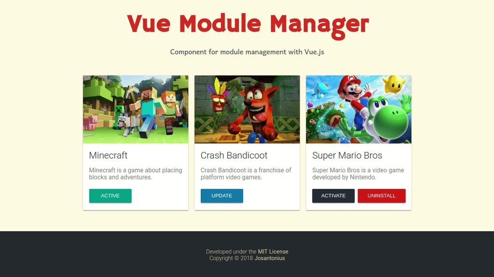

# Vue Module Manager

[](https://www.npmjs.com/package/vue-module-manager)
[](LICENSE)

[Versión en español](README-ES.md)

Component for module management with Vue.js.

<p align="center">
  <a href="https://josantonius.github.io/vue-module-manager/" title="Vue Module Manager">
    
  </a>
</p>

---

- [Demo](#demo)
- [Quick Start](#quick-start)
- [Examples](#examples)
- [Props](#props)
- [Events](#events)
- [Methods](#methods)
- [Tests](#tests)
- [Sponsor](#Sponsor)
- [License](#license)

---

## Demo

[GitHub](https://josantonius.github.io/vue-module-manager/)

[CodePen](https://codepen.io/Josantonius/pen/PQoxXd/)

## Quick Start

### NPM

Install the package:

    npm install vue-module-manager

Register the component:

```js
import Vue from 'vue'
import VueModuleManager from 'VueModuleManager'

Vue.component('VueModuleManager', VueModuleManager)
```

Use the component:

```html
<vue-module-manager :items="[]"></vue-module-manager>
```

### CDN

Include styles:

```html
<link href="https://unpkg.com/vue-module-manager/dist/vue-module-manager.min.css">
```

Include scripts:

```html
<script src="https://unpkg.com/vue/dist/vue.js"></script>
<script src="https://unpkg.com/vue-module-manager/dist/vue-module-manager.min.js"></script>
```

Register the component:

```js
Vue.component('VueModuleManager', VueModuleManager.VueModuleManager)
```

Use the component:

```html
<vue-module-manager :items="[]"></vue-module-manager>
```

## Examples

Examples of use for this component:

### - Using [CDN](#cdn)

```html
<!DOCTYPE html>
<html>

  <head>
    <link href="https://unpkg.com/vue-module-manager/dist/vue-module-manager.min.css" rel="stylesheet">
    <meta name="viewport" content="width=device-width, initial-scale=1, maximum-scale=1, user-scalable=no, minimal-ui">
  </head>

  <body>

    <div id="app">
      <vue-module-manager :items="[]"></vue-module-manager>
    </div>
    
    <script src="https://unpkg.com/vue/dist/vue.js"></script>
    <script src="https://unpkg.com/vue-module-manager/dist/vue-module-manager.min.js"></script>

    <script>
      Vue.component('VueModuleManager', VueModuleManager.VueModuleManager)
      new Vue().$mount('#app')
    </script>

  </body>

</html>
```

### - Adding [items](#items)

```html
<vue-module-manager
  :items="items"
></vue-module-manager>
```

```js
new Vue({
  el: '#app',
  components: { VueModuleManager },
  data () {
    return {
        {
          'name': 'Minecraft',
          'version': '1.12.2',
          'description': 'Minecraft is a game about placing blocks and adventures.',
          'state': 'active',
          'url': 'https://github.com/Josantonius/vue-module-manager',
          'image': '/static/minecraft.jpg'
        },
        {
          'name': 'Crash Bandicoot',
          'version': '8.1.1',
          'description': 'Crash Bandicoot is a franchise of platform video games.',
          'state': 'outdated',
          'url': 'https://github.com/Josantonius/vue-module-manager',
          'image': '/static/crash-bandicoot.jpg'
        },
        {
          'name': 'Super Mario Bros',
          'version': '3.8.4',
          'description': 'Super Mario Bros is a video game developed by Nintendo.',
          'state': 'inactive',
          'url': 'https://github.com/Josantonius/vue-module-manager',
          'image': '/static/super-mario-bros.jpg'
        }
      ]
    }
  }
})
```

### - Setting the button [translations](#translations)

```html
<vue-module-manager
  :items="items"
  :translations="translations"
></vue-module-manager>
```

```js
new Vue({
  el: '#app',
  components: { VueModuleManager },
  data () {
    return {
      items: [{}, {}, {}],
      translations: {
        active: 'activo',
        activate: 'activar',
        install: 'instalar',
        update: 'actualizar',
        uninstall: 'desinstalar'
      },
    }
  }
})
```

### - Listening the [events](#events)

```html
<vue-module-manager
  :items="items"
  @on-change="onChange"
  @on-active="onActive"
  @on-inactive="onInactive"
  @on-update="onUpdate"
  @on-install="onInstall"
  @on-uninstall="onUninstall"
  @on-uninstalled="onUninstalled"
></vue-module-manager>
```

```js
new Vue({
  el: '#app',
  components: { VueModuleManager },
  data () {
    return {
      items: [
        {'state': 'active'},
        {'state': 'outdated'},
        {'state': 'inactive'}
      ]
    }
  },
  methods: {
    onChange: function onChange (index, vm) {
      console.info('@on-change: ' + index)
    },
    onActive: function onActive (index, vm) {
      console.info('@on-active: ' + index)
    },
    onInactive: function onInactive (index, vm) {
      console.info('@on-inactive: ' + index)
    },
    onUpdate: function onUpdate (index, vm) {
      console.info('@on-update: ' + index)
    },
    onInstall: function onInstall (index, vm) {
      console.info('@on-install: ' + index)
    },
    onUninstall: function onUninstall (index, vm) {
      console.info('@on-uninstall: ' + index)
    },
    onUninstalled: function onUninstalled (index, vm) {
      console.info('@on-uninstalled: ' + index)
    }
  }
})
```

### - Listening to the [@on-install](#on-install) event and [stopping the loader](#changestate) with set timetout

```html
<vue-module-manager
  :items="items"
  @on-install="onInstall"
></vue-module-manager>
```

```js
new Vue({
  el: '#app',
  components: { VueModuleManager },
  data () {
    return {
      items: [
        {'state': 'active'},
        {'state': 'outdated'},
        {'state': 'inactive'}
      ]
    }
  },
  methods: {
    onInstall: function onInstall (index, vm) {
      setTimeout(function () {
        vm.changeState(index)
      }, 3000)
    }
  }
})
```

### - Listening to the [@on-uninstall](#on-uninstall) event and [stopping the loader](#changestate) after a certain time

```html
<vue-module-manager
  :items="items"
  @on-uninstall="onUninstall"
></vue-module-manager>
```

```js
new Vue({
  el: '#app',
  components: { VueModuleManager },
  data () {
    return {
      items: [
        {'state': 'active'},
        {'state': 'outdated'},
        {'state': 'inactive'}
      ]
    }
  },
  methods: {
    onUninstall: function onUninstall (index, vm) {
      setTimeout(function () {
        vm.changeState(index)
      }, 3000)
    }
  }
})
```

### - Listening to the [@on-update](#on-update) event, [stopping the loader](#changestate) after a certain time and updating the module information

```html
<vue-module-manager
  :items="items"
  @on-update="onUpdate"
></vue-module-manager>
```

```js
new Vue({
  el: '#app',
  components: { VueModuleManager },
  data () {
    return {
      items: [
        {
          'name': 'Crash Bandicoot',
          'version': '8.1.1',
          'description': 'Crash Bandicoot is a franchise of platform video games.',
          'state': 'outdated',
          'url': 'https://github.com/Josantonius/vue-module-manager',
          'image': '/static/crash-bandicoot.jpg'
        }
      ]
    }
  },
  methods: {
    onUpdate: function onUpdate (index, vm) {
      let self = this
      console.info('@on-update: ' + index)
      setTimeout(function () {
        vm.changeState(index)
        self.items[index].version = '8.1.2'
        self.items[index].name = 'Crash Bandicoot III'
        self.items[index].description = 'Crash Bandicoot N. Sane Trilogy is a video game compilation.'
        self.items[index].image = 'static/crash-bandicoot-trilogy.jpg'
      }, this.delay)
    },
  }
})
```

## Props

Available props in this component:

### :items

Description: Modules array.

Type: `Array`

Required: `true`

Default: `null`

```html
<vue-module-manager :items="[]">
```

### :translations

Description: Translations for module button states.

Type: `Object`

Default: `null`

```html
<vue-module-manager :items="[]" :translations="{}">
```

## Events

Available events in this component:

### @on-change

It's triggered every time change the module state.

```js
onChange: function onChange (index, vm) { }
```

| Attribute | Type | Description
| --- | --- | --- |
| index | `Number` | Module index.
| index | `Object` | Component instance.

```html
<vue-module-manager :items="[]" @on-change="onChange">
```

### @on-active

It's triggered when the module state changes from inactive to active.

```js
onActive: function onActive (index, vm) { }
```

| Attribute | Type | Description
| --- | --- | --- |
| index | `Number` | Module index.
| index | `Object` | Component instance.

```html
<vue-module-manager :items="[]" @on-active="onActive">
```

### @on-inactive

It's triggered when the module state changes from active to inactive.

```js
onInactive: function onInactive (index, vm) { }
```

| Attribute | Type | Description
| --- | --- | --- |
| index | `Number` | Module index.
| index | `Object` | Component instance.

```html
<vue-module-manager :items="[]" @on-inactive="onInactive">
```

### @on-uninstalled

It's triggered when the module state changes from uninstall to uninstalled.

```js
onUninstalled: function onUninstalled (index, vm) { }
```

| Attribute | Type | Description
| --- | --- | --- |
| index | `Number` | Module index.
| index | `Object` | Component instance.

```html
<vue-module-manager :items="[]" @on-uninstalled="onUninstalled">
```

### @on-install

It's triggered when the module state changes from uninstalled to install.

```js
onInstall: function onInstall (index, vm) { }
```

| Attribute | Type | Description
| --- | --- | --- |
| index | `Number` | Module index.
| index | `Object` | Component instance.

```html
<vue-module-manager :items="[]" @on-install="onInstall">
```

This state will activate an installation icon that must be disabled from the event through the [changeState](#changestate) method:

```js
vm.changeState(index)
```

[See examples.](#examples)

### @on-uninstall

It's triggered when the module state changes from installed to install.

```js
onUninstall: function onUninstall (index, vm) { }
```

| Attribute | Type | Description
| --- | --- | --- |
| index | `Number` | Module index.
| index | `Object` | Component instance.

```html
<vue-module-manager :items="[]" @on-uninstall="onUninstall">
```

This state will activate an uninstallation icon that must be disabled from the event through the [changeState](#changestate) method:

```js
vm.changeState(index)
```

[See examples.](#examples)

### @on-update

It's triggered when the module state changes from outdated to update.

```js
onUpdate: function onUpdate (index, vm) { }
```

| Attribute | Type | Description
| --- | --- | --- |
| index | `Number` | Module index.
| index | `Object` | Component instance.

```html
<vue-module-manager :items="[]" @on-update="onUpdate">
```

This state will activate an update icon that must be disabled from the event through the [changeState](#changestate) method:

```js
vm.changeState(index)
```

[See examples.](#examples)

## Methods

Available methods in this component:

### changeState

Switches to the next module state.

```js
vm.changeState(index)
```

| Attribute | Type | Description | Required
| --- | --- | --- | --- |
| index | `Number` | Module index. | `true`

## Tests

Clone the repository:

    git clone https://github.com/Josantonius/vue-module-manager.git vue-module-manager

Go to the directory:

    cd vue-module-manager

Install dependencies:

    npm install

Run [unit tests](test):

    npm run test

Run [ESLint](https://eslint.org/) to ensure that code style is compatible with [Standar JavaScript](https://standardjs.com/):

    npm run lint

Run [serve](docs) with hot reload:

    npm run dev

Build [distribution](dist) with minification:

    npm run bundle

Build [demo](docs) for production with minification:

    npm run build

Run all the above:

    npm run finish

## Sponsor

If this project helps you to reduce your development time,
[you can sponsor me](https://github.com/josantonius#sponsor) to support my open source work :blush:

## License

This repository is licensed under the [MIT License](LICENSE).

Copyright © 2018-2022, [Josantonius](https://github.com/josantonius#contact)
